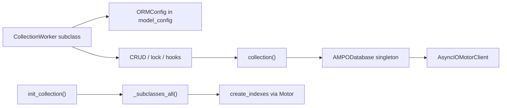

# AMPO — Agent Guide

Async ORM for MongoDB: Pydantic models as documents, Motor for I/O.

## What this project is

Python library (`ampo`) that maps Pydantic v2 models to MongoDB collections. Users subclass `CollectionWorker`, configure via `ORMConfig`, call `AMPODatabase(url=...)` once, then `await init_collection()`.

- Python ≥ 3.9 (package classifiers may lag; changelog dropped 3.8)
- Dependencies: `motor>=3.2`, `pydantic>=2.8`, `typing_extensions`
- Build: hatchling (`pyproject.toml`); version from `ampo/__init__.py`

## Layout

```
ampo/
  __init__.py   # public API re-exports
  db.py         # AMPODatabase singleton (Motor client)
  worker.py     # CollectionWorker + relationships + init_collection
  utils.py      # ORMConfig, indexes, locks, hooks, helpers
  types.py      # PydanticObjectId (Annotated ObjectId)
  errors.py     # AmpoException hierarchy
  log.py        # logger "ampo"
tests/          # unittest.IsolatedAsyncioTestCase; needs TEST_MONGO_URL
docs/           # relationships examples
README.md       # user-facing usage
```

Public API (keep stable unless intentionally breaking):

`AMPODatabase`, `CollectionWorker`, `ORMConfig`, `init_collection`, `RFManyToMany`, `RFOneToMany`, `PydanticObjectId`

## Architecture



### Database (`db.py`)

- `AMPODatabase` is a **singleton** (`SingletonMeta`). First call needs `url=`; later calls reuse the instance. Tests use `AMPODatabase.clear()`.
- Holds Motor client + default DB from the URL. `get_db()` returns the database handle.
- All collection access goes through `CollectionWorker.collection()` → `AMPODatabase().get_db().get_collection(...)`.

### Models (`worker.py`)

`CollectionWorker` extends `pydantic.BaseModel` (`validate_assignment=True`).

| Concern | Behavior |
|--------|----------|
| Identity | Internal `_id: ObjectId`; public `id` property returns `str \| None`. New docs: `_id is None` → insert; else replace. |
| Persistence | `save`, `save_bulk`, `get`, `get_all`, `get_all_cursor`, `delete`, `count`, `exists` |
| Filters | `_prepea_filter_get`: maps `id` → `_id`, str → `ObjectId` |
| Dump for DB | `model_dump()` strips relation attrs and writes `*_ids` / `*_id` ObjectId refs |
| Codec | Always `tz_aware=True` on collection codec options |

`init_collection()` walks all subclasses with `orm_collection` and creates indexes (TTL, unique, partialFilterExpression, commitQuorum). Call once after models are imported.

### Config (`utils.py` + `ORMConfig`)

`ORMConfig` extends Pydantic `ConfigDict` with:

- `orm_collection` (required) — collection name
- `orm_indexes` — list of `{keys, options?, skip_initialization?, commit_quorum?}`
- `orm_bson_codec_options` — optional `CodecOptions`
- `orm_lock_record` — optimistic lock via boolean + start datetime fields
- `orm_hooks` — `pre_save` / `post_save` / `pre_delete` / `post_delete` async callables `(obj, context)`

Helper models: `ORMIndex`, `ORMIndexOptions`, `ORMLockRecord`, `ORMHooks`.

### Relationships

Declared with Annotated types (detected by Field `title`):

- `RFManyToMany[T]` → DB field `{name}_ids: list[ObjectId]`
- `RFOneToMany[T]` → DB field `{name}_id: ObjectId | null`

Related docs must be saved before parent save. On read, `_rel_get_data` loads related objects (eager). Embeds: plain nested `BaseModel` fields (stored as documents).

### Locking

Configured via `orm_lock_record`. Uses `findOneAndUpdate`. Stale locks reclaimable after `lock_max_period_sec` (default 15 min). APIs: `get_and_lock`, `reset_lock`, `get_and_lock_context`, `get_lock_wait_context`. Raises `AmpoDocumentIsLock` / `AmpoDocumentNotFound`.

### Types & errors

- `PydanticObjectId` — Annotated BSON `ObjectId` for model fields; annotation metadata must keep `title="ObjectId"` (used by relation helpers).
- Exceptions: `AmpoException` → `AmpoDocumentNotFound`, `AmpoDocumentIsLock` (optional `doc_id`).

## Conventions for changes

- Docstrings: NumPy/SciPy style.
- Prefer async Motor APIs; no sync PyMongo in library code.
- Do not break public exports in `ampo/__init__.py` without a changelog entry.
- Relation field detection depends on Annotated Field `title` (`RFManyToMany` / `RFOneToMany` / `ObjectId`) — preserve titles when touching types.
- `_id` / `id` duality: keep filter prep and dump/load consistent.
- Index TTL: only single-field keys; `expireAfterSeconds=-1` skips until set via `expiration_index_update`.
- Prefer `collection()` over deprecated `_get_collection()`.

## Tests & local work

```bash
env TEST_MONGO_URL=mongodb://localhost/test pytest
```

- Tests skip if `TEST_MONGO_URL` is unset.
- Each test typically drops DB in `asyncSetUp` and calls `AMPODatabase.clear()` in tearDown.
- Root scripts like `check-bulk.py`, `test_2.py`, `.env` are local/scratch — do not treat as library API.

## Changelog

User-facing changes go in `changelog.md` (Keep a Changelog). Bump version in `ampo/__init__.py` when releasing.
